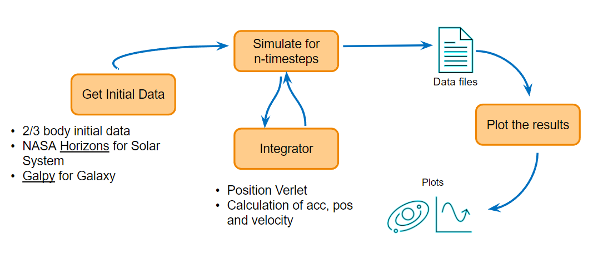
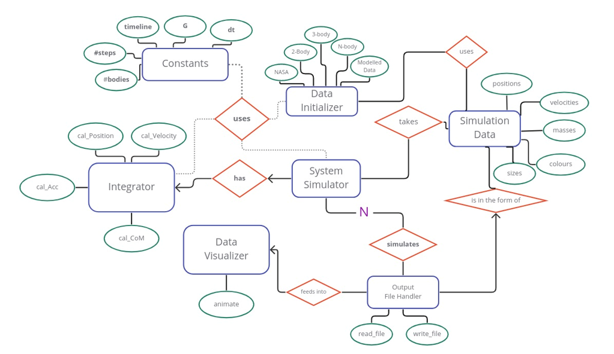

# Gravitational N Body
Gravitational N-Body Simulation using Symplectic Integrator

## Introduction
The N-body problem, in physics, describes as the problem of predicting the
individual motions of a group of celestial objects interacting with each other
due to the gravitational force. The desire to understand the motions of the
Sun, Moon, planets and visible stars is the motivation for solving this problem.
In the recent century, understanding the dynamics of globular cluster star sys-
tems became an important N-body problem. The n-body problem in general
relativity is considerably more difficult to solve.

## Description
This is a python project to simulate N-body systems under influence of Gravitation force between them.
The project has modules for simulation of 2-body, 3-body, Solar System and scientifically modelled system.

Nasa data is obtained from the Horizons website using their APIs https://ssd.jpl.nasa.gov/horizons/
Galaxy data is created with Galpy module https://docs.galpy.org/en/v1.8.1/index.html


## Approach
The aim of this project was to create an N-body simulator which when fed with
appropriate data of bodies, simulates the system for velocity and positions of
bodies for a given time period.


The approach for the implementation was as follows:
1. Model Initial starting Data for the system.
2. Using the above data, simulate the system for the time being. The simulator
uses the integration method described further to calculate the new positions
and velocities of bodies at each time step
4. Write Simulated data to files
5. Use the simulated data to visualize the movements of the N-body system
over the time period

## Entity Relationship Diagram(ERD)
The relationship between entities in this project are as follows:




In this figure, rectangles imply entities, such as simulation data, data ini-
tializer, constants, integrator, system simulation, and data visualizer. Has been
shown by rhomboid, the relation between entities. For instance, constants have
a ”use” relation with the data initializer, system simulation, and integrator.
Each entity has some attributes which are shown by circles. Give Simulation
Data as an example, it contains namely positions, velocities, masses, colors, and
sizes.

## Data Modelling
For the simulation to be visualized, we are primarily interested in the time step
and positions of bodies. The integrator needs the masses, and the momentum
needs to be plotted for the system to confirm the stability. Hence the data used
in the system is modeled as SimulationData object. At every time step, the
updated positions for all bodies are saved as objects of SimulationData.
The initial data creation is governed by the DataInitializer class. For N-body
(2-body, 3-body systems)random data is generated.

## NASA Horizons Data
Using the data of NASA[https://ssd.jpl.nasa.gov/horizons/] 1 enables us to simulate the integration between planets
in our galaxy. A total of 30 bodies consisting of the Sun, 8 planets of the Solar
System, Pluto, and their biggest moons are extracted from by using astroquery
library. The information regarding positions and velocities are obtained using
HorizonClass and other relative information, for example, name, mass, size are
extracted directly from NASA website. All of this information can be extracted
as a data frame using nasa data.

### Modelled Data for Galaxy
The data for modeling a Galaxy is initialized using the Galpy library, which
has a list of potential functions available. The Milky Way Galaxy resembling
Potential is available in the form of MWPotential2014.

1. The getModelData() method in the DataInitializer takes care of generat-
ing modelled scientific Data.
2. Initial positions of N-bodies are initialized using a Gaussian distribution.
3. An object of MWPotential2014 potential is created. There is an option
to add an additional black hole, dynamic friction. For our implementation, we
go with basic MWPotential2014 potential.
4. Using MWPotential2014[1] potential function (1-disc shaped), evaluate method
is called using position, to get the momentum, and in turn velocities of each
body. The results are initialized as an object of SimulationData to be fed into
the system.

## Integration
The integration part of an N-body simulation is mainly comprised of 3 major
steps:
1. calculation of gravitational forces between the bodies and thus the accel-
eration for each of the bodies
2. calculation of velocity for each body
3. calculation of position
Depending on the combination of these 3 general calculation steps and depend-
ing on the fraction of the time step we use for each calculation we were able to
achieve the different integration methods.

### Numerical Method
The integration is similarly dependent on three parameters:
1. The position of the body (relative to the other bodies in the system)
2. The mass of the body
3. The velocity of the body
Our entry data for each integration step is thus always comprised of 3 arrays
containing these parameters. For the purpose of speeding up the calculation, we
vectorized our problem and by doing so we evaded calculating the gravitational
forces for each body individually (with a double ”for loop” which slows down
the calculation drastically) and rather use matrix operations instead. All the
calculation steps were written as an integrator class function.

### Calculation of acceleration
The calculation of acceleration begins with filling out a matrix with the positions
array in such a way that it returns a 3D array in the shape of (N, N,3) (with the
3rd dimension being the position vector of the body in x,y and z directions).
Each row of this matrix is essentially entirely populated with the position vector
of the same body. In the next step, we switch the rows and columns so that
each column is entirely populated by the same position vector. By subtracting
these two matrices we get the directional vectors from the body to body. From
this matrix, we are able to calculate a matrix of absolute distances in the form
of an array in the shape of (N, N).
In the next step we calculate: 
```math
{-G\frac{r_{ij}}{|r_{ij}|^3}}
```


We then sum the rows of the matrix to get the acceleration vector for each body in the x,y, and z directions. 
What we are left with is an array of shapes (N,3) which essentially represents:   

Since we have division by 0 along the matrix diagonal which in turn returns
a calculation error (because the vector rii = [0, 0, 0]) we once again assign 0
across the diagonal with the following two lines of code. We then multiply the
given matrix with a masses matrix that populates each column of the matrix
with a mass of each body. In order to do that we have to expand the masses
array of shapes (N) to an array of shapes (N,N,3).

We now have calculated:

```math
{-G\frac{r_{ij}m_{j}}{|r_{ij}|^3}}
```
We then sum the rows of the matrix to get the acceleration vector for each
body in the x,y, and z directions. What we are left with is an array of shapes
(N,3) which essentially represents:
```math
{\forall  i \in{[1,N]}: \a_i=\sum_{j=1}^N-G\frac{r_{ij}m_j}{|r_{ij}|^3}}
```

### Calculation of velocity and position
With the calculated acceleration for each body, we can then calculate the veloc-
ity and final position of the body at the next time step. Besides the calculated
acceleration, the entry data for this calculation step is a matrix of initial veloc-
ity (i.e velocity at the beginning of the integration step) and initial position (i.e
position at the beginning of the integration step), both of these being arrays of
the shape (N,3). The velocity is calculated by summing the acceleration array
multiplied by x∆t and the initial velocity array together, where x is the fraction
of ∆t we are using in our integration (e.g. we use a half-time step in frog leap
integration). This essentially represents:

```math
{\forall  i \in{[1,N]}: \v_{i}=a_{i}x{\Delta}{t}}
```

The position is similarly calculated by summing the velocity array multiplied
by x∆t and the initial position array together:

```math
{\forall  i \in{[1,N]}: \{r_{i}=v_{i}x{\Delta}{t}} 
```
### Install Project Using setup.py

The strucure of the project shown in following:
```
/path/to/Gravitational-N-Body/project/
├── package/                        Source dir.
│   └── modules.py                  Example module.
│   ├── __init__.py                 This makes the directory a package.
│   └── example_module.py       
├── main.py
├── test/                         
├── README.md                       README with info of the project.
└── setup.py                        Configuration details of the python package.
```

To install the project as a module, you can run this command line in the directory in which setup.py arise:

```commandline
pip install setup.py
```

## Test and Deploy

The built-in continuous integration in GitLab is configured for the project. Every merge request or commit will trigger the pipeline for running the unit test cases. https://git.imp.fu-berlin.de/cs2022/project-1/Gravitational-N-Body/-/pipelines 

Locally the test cases can be run by navigating to the cloned project folder and installing the dependencies using pip-install

```
cd GRAVITATIONAL-N-BODY
pip install -r requirements.txt
pytest 
```

Contributions: Deniz Naz A., Ishita S., Mark G., Neda R., Fatemeh T., Xiaofan X.
Department of Mathematics, Freie Universit at Berlin
February 2023
