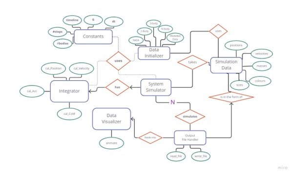

# Gravitational N Body
Gravitational N-Body Simulation using Symplectic Integrator

## Introduction
The N-body problem, in physics, describes as the problem of predicting the
individual motions of a group of celestial objects interacting with each other
due to the gravitational force. The desire to understand the motions of the
Sun, Moon, planets and visible stars is the motivation for solving this problem.
In the recent century, understanding the dynamics of globular cluster star sys-
tems became an important N-body problem. The n-body problem in general
relativity is considerably more difficult to solve.

## Description
This is a python project to simulate N-body systems under influence of Gravitation force between them.
The project has modules for simulation of 2-body, 3-body, Solar System and scientifically modelled system.

Nasa data is obtained from the Horizons website using their APIs https://ssd.jpl.nasa.gov/horizons/
Galaxy data is created with Galpy module https://docs.galpy.org/en/v1.8.1/index.html


## Approach
The aim of this project was to create an N-body simulator which when fed with
appropriate data of bodies, simulates the system for velocity and positions of
bodies for a given time period.
The approach for the implementation was as follows:
1. Model Initial starting Data for the system.
2. Using the above data, simulate the system for the time being. The simulator
uses the integration method described further to calculate the new positions
and velocities of bodies at each time step
4. Write Simulated data to files
5. Use the simulated data to visualize the movements of the N-body system
over the time period

## Entity Relationship Diagram(ERD)
The relationship between entities in this project are as follows:



In this figure, rectangles imply entities, such as simulation data, data ini-
tializer, constants, integrator, system simulation, and data visualizer. Has been
shown by rhomboid, the relation between entities. For instance, constants have
a ”use” relation with the data initializer, system simulation, and integrator.
Each entity has some attributes which are shown by circles. Give Simulation
Data as an example, it contains namely positions, velocities, masses, colors, and
sizes.

## Data Modelling
For the simulation to be visualized, we are primarily interested in the time step
and positions of bodies. The integrator needs the masses, and the momentum
needs to be plotted for the system to confirm the stability. Hence the data used
in the system is modeled as SimulationData object. At every time step, the
updated positions for all bodies are saved as objects of SimulationData.
The initial data creation is governed by the DataInitializer class. For N-body
(2-body, 3-body systems)random data is generated.


### Install Project Using setup.py

The strucure of the project shown in following:
```
/path/to/Gravitational-N-Body/project/
├── package/                        Source dir.
│   └── modules.py                  Example module.
│   ├── __init__.py                 This makes the directory a package.
│   └── example_module.py       
├── main.py
├── test/                         
├── README.md                       README with info of the project.
└── setup.py                        Configuration details of the python package.
```

To install the project as a module, you can run this command line in the directory in which setup.py arise:

```commandline
pip install setup.py
```

## Test and Deploy

The built-in continuous integration in GitLab is configured for the project. Every merge request or commit will trigger the pipeline for running the unit test cases. https://git.imp.fu-berlin.de/cs2022/project-1/Gravitational-N-Body/-/pipelines 

Locally the test cases can be run by navigating to the cloned project folder and installing the dependencies using pip-install

```
cd GRAVITATIONAL-N-BODY
pip install -r requirements.txt
pytest 
```

Contributions: Deniz Naz A., Ishita S., Mark G., Neda R., Fatemeh T., Xiaofan X.
Department of Mathematics, Freie Universit at Berlin
February 2023
