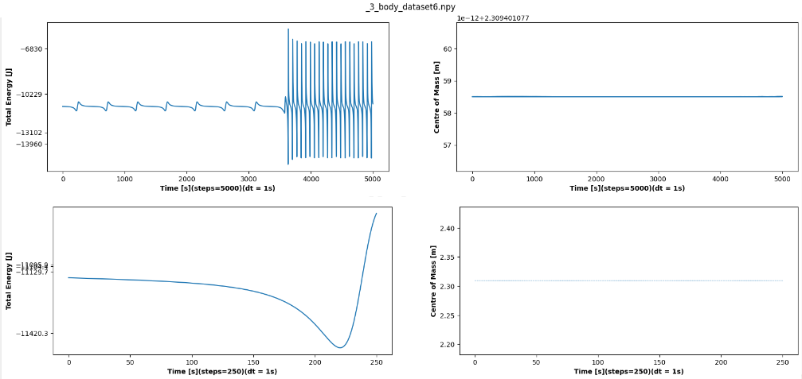

# Gravitational N Body
Gravitational N-Body Simulation using Symplectic Integrator

## Introduction
The N-body problem, in physics, describes as the problem of predicting the
individual motions of a group of celestial objects interacting with each other
due to the gravitational force. The desire to understand the motions of the
Sun, Moon, planets and visible stars is the motivation for solving this problem.
In the recent century, understanding the dynamics of globular cluster star systems became an important N-body problem. The n-body problem in general
relativity is considerably more difficult to solve.

## Description
This is a python project to simulate N-body systems under influence of Gravitation force between them.
The project has modules for simulation of 2-body, 3-body, Solar System and scientifically modelled system.

Nasa data is obtained from the Horizons website using their APIs https://ssd.jpl.nasa.gov/horizons/
Galaxy data is created with Galpy module https://docs.galpy.org/en/v1.8.1/index.html


## Approach
The aim of this project was to create an N-body simulator which when fed with
appropriate data of bodies, simulates the system for velocity and positions of
bodies for a given time period.


The approach for the implementation was as follows:
1. Model Initial starting Data for the system.
2. Using the above data, simulate the system for the time being. The simulator
uses the integration method described further to calculate the new positions
and velocities of bodies at each time step
4. Write Simulated data to files
5. Use the simulated data to visualize the movements of the N-body system
over the time period

## Entity Relationship Diagram(ERD)
The relationship between entities in this project are as follows:


In this figure, rectangles imply entities, such as simulation data, data initializer, constants, integrator, system simulation, and data visualizer. Has been
shown by rhomboid, the relation between entities. For instance, constants have
a ”use” relation with the data initializer, system simulation, and integrator.
Each entity has some attributes which are shown by circles. Give Simulation
Data as an example, it contains namely positions, velocities, masses, colors, and
sizes.

## Data Modelling
For the simulation to be visualized, we are primarily interested in the time step
and positions of bodies. The integrator needs the masses, and the momentum
needs to be plotted for the system to confirm the stability. Hence the data used
in the system is modeled as SimulationData object. At every time step, the
updated positions for all bodies are saved as objects of SimulationData.
The initial data creation is governed by the DataInitializer class. For N-body
(2-body, 3-body systems)random data is generated.

## NASA Horizons Data
Using the data of [NASA Horizons data](https://ssd.jpl.nasa.gov/horizons/) 1 enables us to simulate the integration between planets
in our galaxy. A total of 30 bodies consisting of the Sun, 8 planets of the Solar
System, Pluto, and their biggest moons are extracted from by using astroquery
library. The information regarding positions and velocities are obtained using
HorizonClass and other relative information, for example, name, mass, size are
extracted directly from NASA website. All of this information can be extracted
as a data frame using NasaData.

### Modelled Data for Galaxy
The data for modeling a Galaxy is initialized using the Galpy library, which
has a list of potential functions available. The Milky Way Galaxy resembling
Potential is available in the form of MWPotential2014.

1. The getModelData() method in the DataInitializer takes care of generating modelled scientific Data.
2. Initial positions of N-bodies are initialized using a Gaussian distribution.
3. An object of MWPotential2014 potential is created. There is an option
to add an additional black hole, dynamic friction. For our implementation, we
go with basic MWPotential2014 potential.
4. Using MWPotential2014[1] potential function (1-disc shaped), evaluate method
is called using position, to get the momentum, and in turn velocities of each
body. The results are initialized as an object of SimulationData to be fed into
the system.

## Integration
The integration part of an N-body simulation is mainly comprised of 3 major
steps:
1. Calculation of gravitational forces between the bodies and thus the accel-
eration for each of the bodies
2. Calculation of velocity for each body
3. Calculation of position
Depending on the combination of these 3 general calculation steps and depend-
ing on the fraction of the time step we use for each calculation we were able to
achieve the different integration methods.

### Numerical Method
The integration is similarly dependent on three parameters:
1. The position of the body (relative to the other bodies in the system)
2. The mass of the body
3. The velocity of the body
Our entry data for each integration step is thus always comprised of 3 arrays
containing these parameters. For the purpose of speeding up the calculation, we
vectorized our problem and by doing so we evaded calculating the gravitational
forces for each body individually (with a double ”for loop” which slows down
the calculation drastically) and rather use matrix operations instead. All the
calculation steps were written as an integrator class function.

### Calculation of acceleration
The calculation of acceleration begins with filling out a matrix with the positions
array in such a way that it returns a 3D array in the shape of (N, N,3) (with the
3rd dimension being the position vector of the body in x,y and z directions).
Each row of this matrix is essentially entirely populated with the position vector
of the same body. In the next step, we switch the rows and columns so that
each column is entirely populated by the same position vector. By subtracting
these two matrices we get the directional vectors from the body to body. From
this matrix, we are able to calculate a matrix of absolute distances in the form
of an array in the shape of (N, N).
In the next step we calculate: 
```math
{-G\frac{r_{ij}}{|r_{ij}|^3}}
```

Since we have division by 0 along the matrix diagonal which in turn returns
a calculation error (because the vector rii = [0, 0, 0]) we once again assign 0
across the diagonal with the following two lines of code. We then multiply the
given matrix with a masses matrix that populates each column of the matrix
with a mass of each body. In order to do that we have to expand the masses
array of shapes (N) to an array of shapes (N,N,3).

We now have calculated:

```math
{-G\frac{r_{ij}m_{j}}{|r_{ij}|^3}}
```
We then sum the rows of the matrix to get the acceleration vector for each
body in the x,y, and z directions. What we are left with is an array of shapes
(N,3) which essentially represents:
```math
{\forall  i \in{[1,N]}: a_i=\sum_{j=1}^N-G\frac{r_{ij}m_j}{|r_{ij}|^3}}
```

### Calculation of velocity and position
With the calculated acceleration for each body, we can then calculate the veloc-
ity and final position of the body at the next time step. Besides the calculated
acceleration, the entry data for this calculation step is a matrix of initial veloc-
ity (i.e velocity at the beginning of the integration step) and initial position (i.e
position at the beginning of the integration step), both of these being arrays of
the shape (N,3). The velocity is calculated by summing the acceleration array
multiplied by x∆t and the initial velocity array together, where x is the fraction
of ∆t we are using in our integration (e.g. we use a half-time step in frog leap
integration). This essentially represents:

```math
{\forall  i \in{[1,N]}: v_{i}=a_{i}x{\Delta}{t}}
```

The position is similarly calculated by summing the velocity array multiplied
by x∆t and the initial position array together:

```math
{\forall  i \in{[1,N]}: r_{i}=v_{i}x{\Delta}{t}} 
```

### Calculation of the system’s mechanical energy
The calculation of the system energy gives us a good idea of what is going on
with our simulation as it should stay constant in an isolated system of bodies.
A system of bodies possesses only two mechanical energies:
1. Gravitational potential energy
2. Kinetic energy

For the calculation of the potential we first form two matrices of dimensions
(N,N), one of which we populate row-wise with the mass of each body and the
second one which we populate column-wise with the mass of each body. By
multiplying these two matrices together we get the mimj term in form of an
array of shapes (N, N). We then further divide this matrix with the matrix con-
taining absolute distances. We here again face division by zero on the diagonal,
to which we assign the value of 0. In the next step, we sum all the elements
of the matrix together and multiply it with -G which is in turn the potential
energy of the entire system.

For the calculation of the kinetic energy we basically take the squared velocities
matrix and multiply it with the masses matrix, which returns an array of the
shape (N,3). By making the sum of all the elements and multiplying the result
by factor 0.5 we get the total kinetic energy of the system.
With the sum of these two constants we receive the total mechanical energy of
the system.

## Integrator structure
In this simulation, leapfrog integration method and the
Verlet integration method are utilized. The method is characterized by using a half-time
step for either the calculation of velocity or the calculation of position. Calculation of position is prioritized. Structured integration step as follows:
1. Calculation of Rt+0.5∆t with Vt (we use 0.5∆t)
2. Calculation of Vt+∆t with A(t) calculated at Rt+0.5∆t (we use ∆t)
3. Calculation of Rt+1.5∆t with Vt+∆t (we use 0.5∆t)
4. Calculation of Vt+2∆t with A(t+∆t) calculated at Rt+1.5∆t (we use ∆t)

## Simulation
The data obtained from the Data Source acts as the initial data for the system.
Using the initial data, the defined number of iterations as time steps, and the
step difference dt, the simulation of the system is performed. Once stimulated,
the output data is saved as a Numpy data file. This saved file is then fed into
the Visualisation system, to depict the simulated data.
In the project SystemSimulator is the class for the simulation logic. Once
instantiated with the Integrator, it is called from the main.py. It reads the
simulation duration and time step from constants and calls the Integrator’s
step method to find out the new positions and momenta of bodies at each time
step.

## Results

### 3-Body
In this section, the momentum of 3-body, the center of mass, and the total
energy have been shown.





### Solar System - NASA Horizons data
In this section, the momentum of Solar System, the center of mass, and the
total energy have been shown.

We used the NASA Horizons API service to get data for Solar System bodies.

https://user-images.githubusercontent.com/55834139/233346905-fd68f4ea-a46c-473c-b715-0ff5c641a057.mp4


A total of 30 bodies consisting of the Sun, 8 planets of the Solar System, Pluto, and their biggest moons are extracted from by using Astroquery library which can send API request for multiple bodies. 
The initial position and velocity vectors were taken from 2017-01-01 and the time step is given as 1 day.
Mass and size (diameter) information are extracted by sending API request directly to NASA Horizons API services.


### Modelled Galaxy - using Galpy
In this section, the momentum of a scientifically modeled Galaxy, the center of
mass, and the total energy have been shown.


We used the Galpy library for modeling a Galaxy, which has a list of potential functions available. 
The Milky Way Galaxy resembling Potential is available in the form of MWPotential2014.
Using the MWPotential2014 and a random generated positions, a starting initial data for a disc/spherical/bulge Galaxy like system can be created, which is then fed into our simulator.

## Algorithmic Complexity
In this project, the position verlet is implemented, whose algorithm is described above.
The bottleneck of speeding up the program as a whole would lie in
acceleration calculation, where an O(N2) matrix elements need to be calculated.
So in the rest of this section, we will first introduce Velocity Verlet followed by a
quick review of two algorithms for N-body simulations, that has improved time
complexity.

### Overview of Well-Known Algorithms
The simplest is the Particle-Particle method. The advantage of this algorithm
is its simplicity, which allows vectorization to be used, as in this project. 
Parallelization would be also reasonably straightforward to be implemented. How-
ever, the disadvantage reveals itself fully when N is greater than 1000, since
bodies interact directly with each other, the cost of force calculation is O(N2).
The last time expensive would be the Fast Multipole Method, whose time
complexity is O(n). However, since it uses sophisticated mathematical equa-
tions, it becomes difficult to program in three dimensions. In addition, it has
larger constants in its order of complexity.

So, in the rest of this section, we will start with the symplectic integra-
tor, Velocity Verlet, which is close relative to the one we implemented in the
Verlet integration family used in this project. Then, we will present two most
commonly discussed methods, where force is approximated instead of being ex-
actly calculated: Particle-Particle-Particle-Mesh (P3M), which tries to recover
accuracy lost in the Particle Mesh method while keeping the time complexity
O(NlogN).

### Velocity Verlet
There exist different kinds of Verlet algorithms. We are here concerning mainly the Position Verlet algorithm. We do the following iteratively:

```math
{\textbf{v}_{ n + \frac{1}{2}} = \textbf{v}_{n} + \frac{1}{2} \textbf{a}_{n} \Delta t}
```
```math
{\textbf{x}_{n+1} = \textbf{x}_{n} + \textbf{v}_{n + \frac{1}{2}} \Delta t }
```
```math
{\textbf{v}_{n+1} = \textbf{v}_{n + \frac{1}{2}} + \frac{1}{2} \textbf{a}_{n+1} \Delta t }
```

### Particle-Particle Particle-Mesh (P3M)
Particle-Particle-Particle Mesh is a Fourier-based alternative approach to the
Ewald summation method (Toukmaji et al., 1996). The aim is to calculate
potentials in N-body simulations. It is based on the particle mesh method,
where particles are interpolated onto a grid and the potential is solved for this
grid.
The essence of the method is to express the interparticle force as the sum
of two component parts: the short-range part f sr which is non-zero only for
particle separations less than some cutoff radius re and the smoothly varying
part R which has a transform which is approximately band limited, meaning it
is approximately non-zero for only a limited range of k. The total short-range
force on a particle F^sr is computed by direct particle-particle (PP) pair force
summation and the smoothly varying part is approximated by the particle-
mesh (PM) force calculation. Two meshes are employed in P3M algorithms:
the charge potential-mesh and a chaining mesh, which is a coarser mesh. The
charge potential mesh is used at different stages of the Particle Mesh calculation
to store, in turn, charge density values, charge harmonics, potential harmonics, and potential values. The chaining mesh is a regular array of cells whose sides
have lengths greater than or equal to the cutoff radius re of the short-range
force (Hockney, Roger, 1988).

### Barnes Hut Tree Algorithm
Tree methods organize particles into a hierarchy of clusters, which decomposes
the force into the following:
f = external neighbour force + nearest neighbor force + far-field force
However, the far-field force calculation can rise up to a cost of O(n^2). Barnes
Hut Tree Algorithm solves this issue by calculating the far-field force using
Divide-and-Conquer, namely:
(1) Build a quadtree
(2) For each subsquare in the quadtree, compute the center of mass and total
mass for all the particles it contains
(3) For each particle, traverse the tree to compute the force on it.
With this approach, the time complexity can be reduced to O(NlogN).

## Parallelization

### Parallelize the Particle-Particle Method
As the previous section introduced, force calculation in the Particle-Particle
method is expensive, so the force should be computed in parallel. Let us take
our implemented algorithm for example. The following method is introduced:
The master core holds the information of the current step, i.e. position and
velocity vectors. The force is computed in parallel by storing the partitioned
initial number of N bodies in slave cores, which is responsible for calculating
the force exerted on the bodies it contained. The mater core can then collect
all the new updated acceleration values and use, e.g. the algorithm in section
above, to obtain positions and velocities for the next time step.

### Parallelize the Barnes Hut Tree Algorithm
Since force calculations are independent in a tree traversal, we can also try
to parallelize these calculations in a tree method. One of the intuitions for
Parallelizing the Barnes Hut Tree Algorithm is to partition its quadtree, and
assign them to a different processor, while making sure that each partition has
about N/num of processors bodies. Each processor also stores adjoining parts
of quadtree for computing forces of bodies that is stored. With a subset of the
tree required by each processor, force calculations in step of section above
can then be done in parallel without communicating among processors.

### Install Project Using setup.py

The strucure of the project shown in following:
```
/path/to/Gravitational-N-Body/project/
├── package/                        Source dir.
│   └── modules.py                  Example module.
│   ├── __init__.py                 This makes the directory a package.
│   └── example_module.py       
├── main.py
├── test/                         
├── README.md                       README with info of the project.
└── setup.py                        Configuration details of the python package.
```

To install the project as a module, you can run this command line in the directory in which setup.py arise:

```commandline
pip install setup.py
```

## Test and Deploy

The built-in continuous integration in GitLab is configured for the project. Every merge request or commit will trigger the pipeline for running the unit test cases. https://git.imp.fu-berlin.de/cs2022/project-1/Gravitational-N-Body/-/pipelines 

Locally the test cases can be run by navigating to the cloned project folder and installing the dependencies using pip-install

```
cd GRAVITATIONAL-N-BODY
pip install -r requirements.txt
pytest 
```

Contributions: Deniz Naz A., Ishita S., Mark G., Neda R., Fatemeh T., Xiaofan X., Yagmur S.
Department of Mathematics, Freie Universit at Berlin
February 2023

